# 📌 Dev's Blog

## 📖 Sobre o projeto
Este projeto foi desenvolvido com Angular 14.1.3 como parte de um desafio da DIO para o Decola Tech 2025, onde realizei um fork do repositório original do professor, como foi recomendado, e implementei diversas melhorias e novas funcionalidades.

O Blog Dev tem como objetivo ser um espaço onde desenvolvedores podem acompanhar tendências de mercado, oportunidades de trabalho e novidades do mundo da tecnologia!

## 🚀 Como testar

### Pré-requisitos
- Node.js instalado (versão recomendada: 16.x ou superior)
- Angular CLI instalado globalmente (`npm install -g @angular/cli`)

### Passos
1. Clone o repositório:
   ```sh
   git clone https://github.com/AlissonLimaG/angular-blog.git
   ```
2. Acesse o diretório do projeto:
   ```sh
   cd nome-do-projeto
   ```
3. Instale as dependências:
   ```sh
   npm install
   ```
4. Inicie o servidor de desenvolvimento:
   ```sh
   ng serve
   ```
5. Acesse o projeto no navegador:
   ```
   http://localhost:4200
   ```

## 🔥 Alterações e incrementos
- **Adicionado um formulário** para cadastro de novos artigos e notícias.
- **Modo claro e escuro** implementado para melhor experiência do usuário.
- **Melhorias na responsividade**, garantindo que o blog funcione bem em diferentes dispositivos.
- **Pequenas animações** para tornar a navegação mais fluida e agradável.

## 🖼️ Capturas de tela
- ### Home Desktop
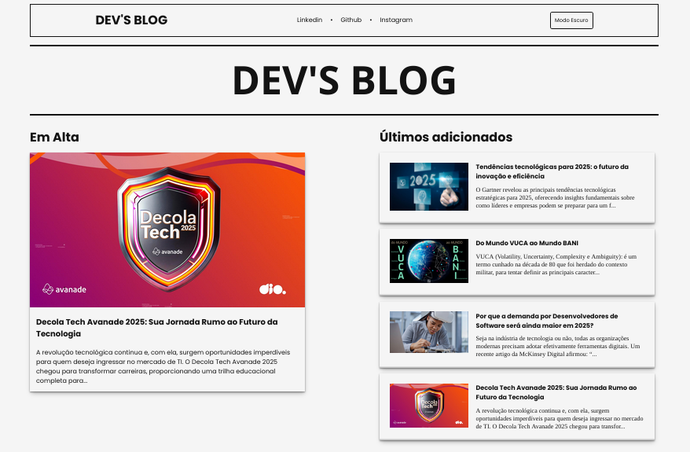
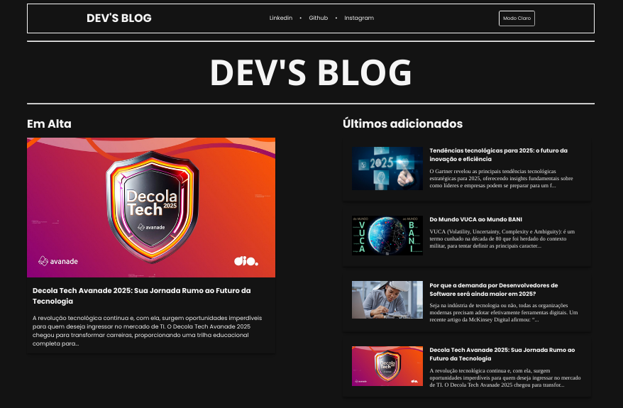

- ### Home Mobile
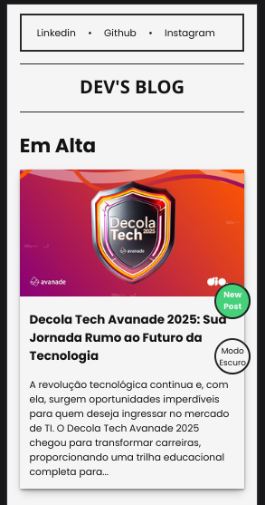
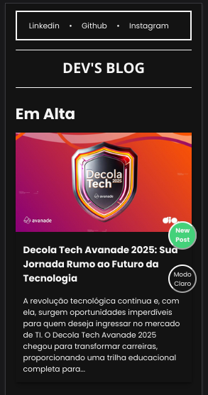

- ### Article Desktop
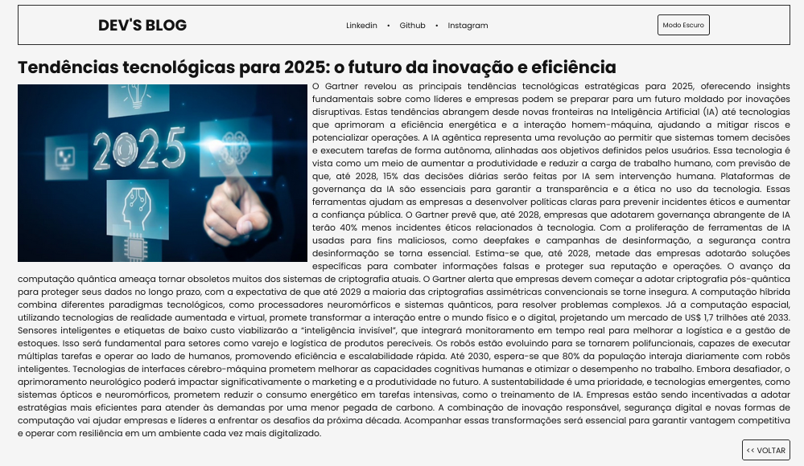
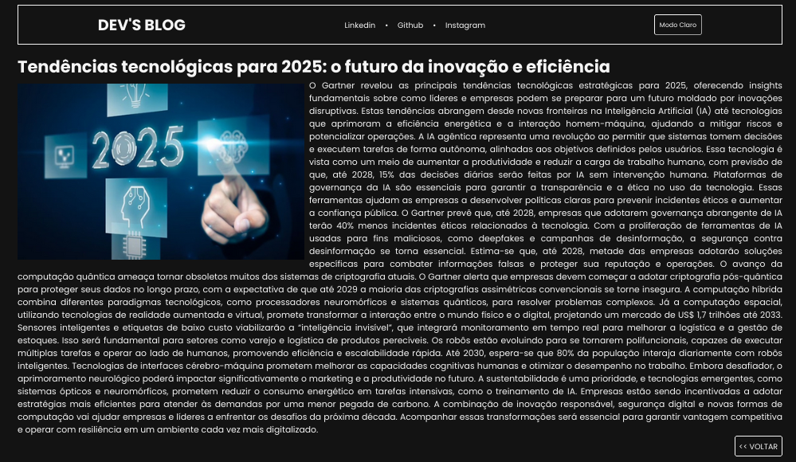

- ### Article Mobile

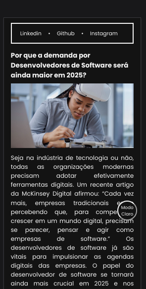

- ### Form Desktop
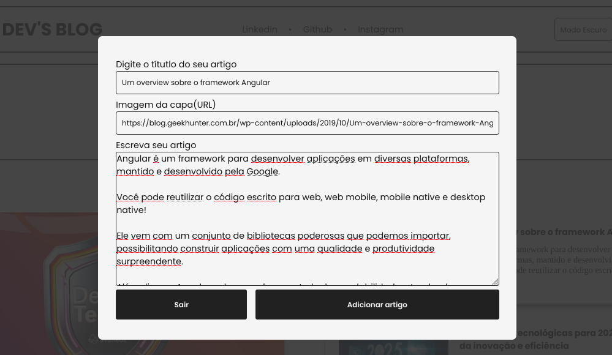

- ### New Article Desktop
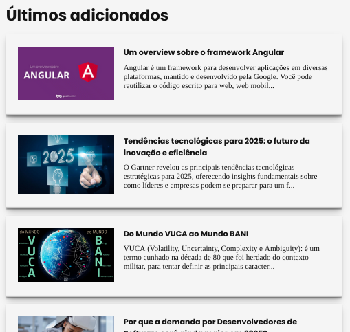

- ### Form Mobile
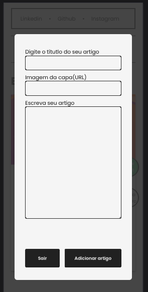
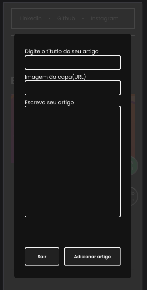


## ⏭️ Próximos passos
- Implementar **validação no formulário** de artigos para garantir dados mais estruturados e consistentes.
- Melhorar ainda mais a **experiência do usuário** com ajustes visuais e usabilidade.
- Explorar **novas funcionalidades**, como categorias e filtros de artigos.

